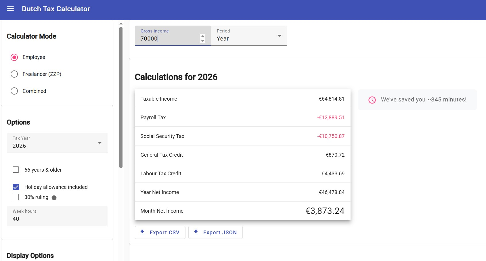

# Dutch Tax Calculator

[](https://opensource.org/licenses/MIT)

A comprehensive Dutch tax calculation system consisting of a core NPM package and a modern Angular web application. Calculate income tax for both employees and freelancers (ZZP'ers) with accurate calculations based on current Dutch tax laws.



## 📦 Packages

This monorepo contains two main packages:

### [dutch-tax-core](./dutch-tax-core/)
[](https://badge.fury.io/js/dutch-tax-income-calculator)

The core NPM package with tax calculation logic. Supports:
- Employee tax calculations (including 30% ruling, holiday allowance)
- Freelancer tax calculations (zelfstandigenaftrek, startersaftrek, MKB-winstvrijstelling)
- VAT calculations
- International tax treaty information
- TypeScript support

### [dutch-tax-income-calculator](./dutch-tax-income-calculator/)

Modern Angular web application providing:
- User-friendly interface for tax calculations
- Real-time calculations
- Responsive design (desktop and mobile)
- Export functionality (JSON/CSV)
- Multi-language support

## 🚀 Quick Start

### Using the NPM Package

```bash
npm install dutch-tax-income-calculator
```

```javascript
import { SalaryPaycheck } from 'dutch-tax-income-calculator';

const paycheck = new SalaryPaycheck({
  income: 60000,
  allowance: true,
  socialSecurity: true
}, 'Year', 2026);

console.log(paycheck.netYear); // Annual net income
```

### Running the Web Application

```bash
cd dutch-tax-income-calculator
npm install
npm start
```

Visit `http://localhost:4200` to use the web calculator.

## 🏗️ Architecture

- **Core Package**: Pure JavaScript/TypeScript tax calculation engine
- **Web App**: Angular frontend consuming the core package
- **Monorepo**: Managed with npm workspaces

## 📋 Features

- ✅ Employee income tax calculations
- ✅ Freelancer (ZZP) tax calculations
- ✅ 30% ruling support
- ✅ Holiday allowance calculations
- ✅ Social security contributions
- ✅ VAT calculations
- ✅ International tax treaties
- ✅ Export to JSON/CSV
- ✅ Responsive web interface
- ✅ TypeScript support

## 🤝 Contributing

We welcome contributions! Please see the individual package READMEs for specific contribution guidelines.

## 📄 License

This project is licensed under the MIT License - see the [LICENSE](./dutch-tax-core/LICENSE) file for details.

## 🙏 Acknowledgments

Originally developed by Stepan Suvorov (@stevermeister). This fork maintains the core functionality while providing an updated, community-maintained version.